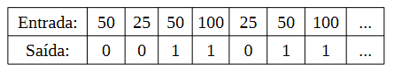
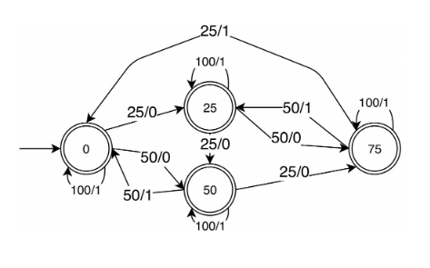

## Sobre
Projeto feito para conclusão da disciplina de autômatos do mestrado de Ciência da Computação. A ideia é simular o funcionamento da máquina de refrigerante na qual você coloca o seu dinheiro e ela calcula o valor informado e libera o produto e o seu troco, caso seja necessário.
Por meio da abstração, foi possível criar classes genericas bases para o autômato como: fita, máquina de estados e transição. Na classe Fita, foi implementada uma segunda fita, pois essa é uma característica principal que difere um transdutor finito de um autômato finito comum.

## Desafio proposto
Implemente um transdutor finito (máquina de Moore ou Mealy) que, dada uma sequência demoedas de 25 e 50 centavos e de 1 real, forneça uma lata de refrigerante quando a sequênciatotalizar 1 real ou mais. Cada moeda inserida deverá corresponder a uma de duas saídas: 0,se uma lata não pode ser (ainda) liberada, ou 1, se uma lata deve ser liberada. Exemplo: 

## Solução
Implementação em java da Máquina de Mealy

## Representação gráfica da implementação

## Tecnologia
Java 13
* Compila no Java 8.

## Diagrama do Transdutor

